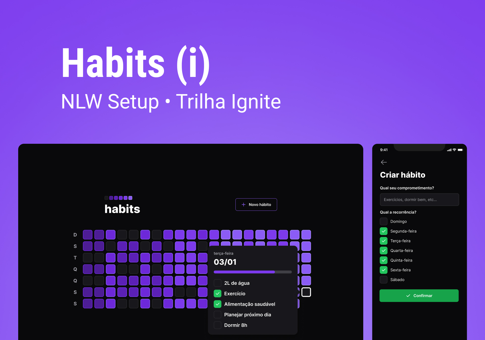

<h1 align="center"> NLW Setup - Trilha Ignite</h1>

  

  

## Projeto está sendo desenvolvido com as seguintes tecnologias:

- [NodeJS](https://nodejs.org/)
- [TypeScript](https://www.typescriptlang.org/)
- [Fastify](https://www.fastify.io/)
- [Prisma](https://www.prisma.io/)
- [ViteJS](https://vitejs.dev/)
- [ReactJS](https://reactjs.org/)
- [TailwindCSS](https://tailwindcss.com/)
- [React Native](https://reactnative.dev/)
- [Expo](https://expo.io/)